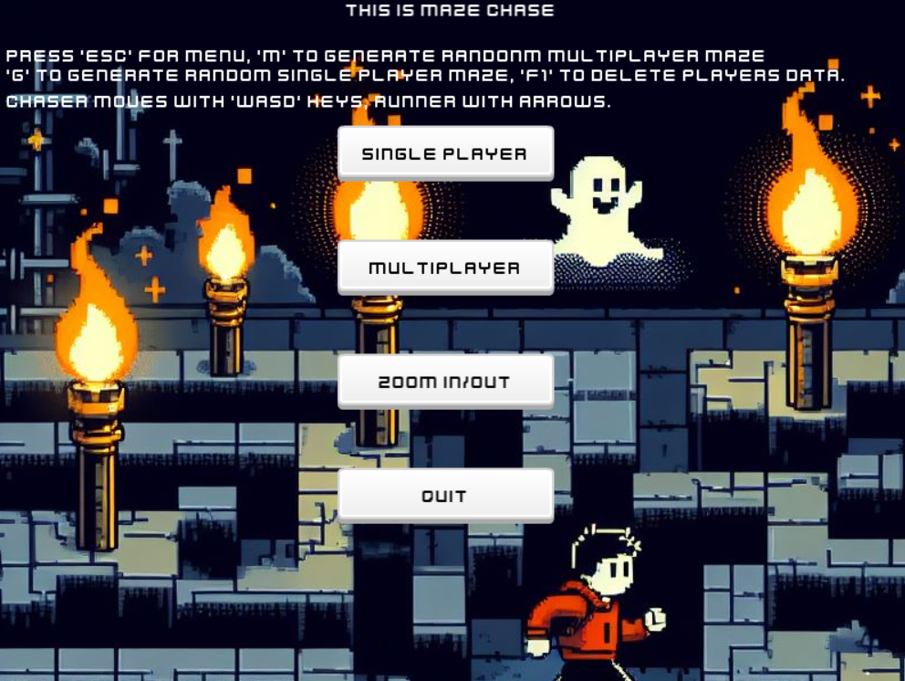

# Maze Chase!

#### Video Demo:  <https://youtu.be/3txN-h0Bpr4?si=ujHRgve65axasXra>

#### Description: The game is about running in an auto generated maze till you find the treasure while being chased



## Overview

Welcome to **Maze Chase**, an exciting Love2D game where you navigate through auto-generated mazes in search of a hidden treasure chest at the end of the maze. Challenge yourself in two thrilling game modes:

### Singleplayer Mode

In singleplayer mode, you find yourself alone in the maze, pursued by both a relentless ghost and a cunning spider. Your goal is to outsmart these creatures and locate the treasure chest before they catch you. Can you navigate the maze and evade the ghost and spider to claim the prize?

### Multiplayer Mode

Switch to multiplayer mode for an added layer of excitement! Play against a friend who controls a second character attempting to catch you before you find the treasure chest. Will you outwit your opponent and emerge victorious, or will they catch you first?

### Key Features

- **Auto-Generated Mazes:** Every playthrough offers a unique maze, keeping the gameplay fresh and challenging.
- **Singleplayer Challenges:** Test your skills as you navigate the maze, avoiding the pursuing ghost and spider.
- **Multiplayer Thrills:** Engage in a cat-and-mouse game with a friend, adding a competitive edge to the exploration.
- **Treasure Hunt:** Locate the hidden treasure chest to secure your victory.
- **Screen Zoom In & Out:** Chose between seeing the whole maze or have it zoomed on you, increasing the difficulty.

## Gameplay

- **Singleplayer Controls:**
  - Move: Arrow keys 

- **Multiplayer Controls:**
  - Player 1 (Runner): Arrow keys
  - Player 2 (Chaser): WASD keys

## Maze Generation

- **Singleplayer:**
    - Pressing **'g'** key will generate a random maze every time it is clicked.

- **Multiplayer:**
    - Pressing **'m'** key will generate a random maze every time it is clicked but for multiplayer game.

## Winning & Losing
- Singleplayer
  - You only have 10 lives and if catched with either the ghost or sipder your lives will decrease by one
  - You lose if you used all your lives
- Multiplayer
  - Both players have 10 lives each
  - The runner wins by finding the treasure at the end of the maze and the chaser's lives get decreased by one
  - The chaser wins by catching the runner and the runner's lives get decreased by one
  - Whoever gets his lives to zero loses

## Scoring System
- Singleplayer
  - Every time you win is counted
  - Highscore is added and updated
- Multiplayer
  - Every time the runner wins the round his score is increased
  - Every time the chaser wins his round score is increased

## Saving and Loading
- The game saves all the status of both single and multi player.
- You can delete the saved data by pressing **'F1'**.
- Pressing **"escape"** will take you to the main menu.

## Files
- ```main.lua```: The first file of the game
  - Has the ```love.load() love.update() love.draw() love.keypressed``` call back functions.
  -  ```love.load()```: has all the required files, libraries and loads the menu.
  - ```love.update(dt)```: updates the ```tick.update(dt)``` and update the game if it's running.
  - ```love.draw()```: draws the game and menu
  - ```love.keypressed(key)```: listens for any key presses of the game
- ```player.lua```: **Player** class file that has all the code of the player 
  - ```Player:new()```: which used to set the instance of the player including, player's image, width, height, position.
  - ```Player:keypressed()```: responsible for the movement of the Runner and the chaser.
  - ```Player:isEmpty()```: Checks if the place the player wants to move to is empty or not
  - ```Player:checkCollision()```: Checks if the player collides with anything
- ```bug.lua```: **Bug** class file which makes the Ghost and Spider that chase the player
  - ```Bug:new()```: sets the properties of the (spider and ghost) bug instances like ```Player:new()```
  - ```Bug:update()```: Responsible for updating the angle and movements of the instance and what happens if the instance collides with the player
  - ```Bug:draw()```: Draws the instance
  - ```Bug:checkCollision()```: Checks if the instance collides with the player
- ```wall.lua```: **Wall** class file that makes the walls and ground
  - Only has the ```Wall:new()``` function that sets the (wall or ground) images and properties
- ```button.lua```: **Button** class file that makes the menu buttons that has:
  - ```Button:new()```: sets the image, click images, position, width and height, text, text color and size scale.
  - ```Button:draw()```: draws the button instance and the text
- ```game.lua```: The biggest file of the project that has:
  - ```gameLoad()``` function that loads the maze, game's music, the saved file or default status, and loads the game depending on the state wheather it's singleplayer or multiplayer
  - ```gameUpdate()```: Updates the Bugs instances, some delay timers and the animation of the treasure
  - ```gameDraw()```: It's called in ```love.draw()```, it draws the maze, runner, chaser, treasure
  - Depending on the game state ```gameDraw()``` will draw the game as multi or single
  - It updates the game data on winning and losing 
  - ```gameKeypressed(key)```: passes the pressed key to ```player:keypressed(key)``` and passed also is he a runner or chaser
  - ```mazeGenerate()```: the function that has the algorithm for creating a random maze every time it is called
  - ```draw()```: this is made to draw the multiple game mode
  - ```savegame()```: stores the scores of the game to a **savedata.txt** file
- ```menu.lua```: the file of the menu that has:
  - ```menuLoad()```: sets the menu song, click sound of the buttons and the buttons of the menu
  - ```menuDraw()```: by default it draws the main menu, but if the player wins or loses it displayes a message and a small menu to continue
  - ```love.mousemoved()```: love2d function that listens to the mouse moving.
  - It is important for the menu and buttons to know if the mouse is on the button
  - ```love.mousepressed()```: listens to the pressings of the mouse
  - ```love.mousereleased()```: listens to the release of the mouse click
- ```conf.lua```:
  - Sets the window icon and title
  - Disables some modules that aren't needed
- Libraries: 
  - ```classic.lua```: for making classes 
  - ```lume.lua``` : for serializing and deserializing the saved data file
  - ```tick.lua```: for delays

## Design Choices
- At first the game was only one maze that i made it by hand but then i felt that it's gonna be repetitive and boring, so i added the auto-generated mazes, it took me a while to come up with the algorithm.
- Now after i made the maze i needed to add a winning and losing mechanism so i add two entities that chase the player one at the start of the maze and one at the and added a treasure chest at the end of the maze that the player must get to win
- At first when the player gets to the treasure he get sent to the menu and see a winning message but i felt it would be better to just let him play again and again instead of getting him out of the game every round
- For losing i added later 10 lives for the player that if he get caught and uses all of them he loses and be sent to the menu 
- There was no intention for making a multiplayer but it seemed a good idea to add a competitive element to the game, so i added another winning and losing rules for the multiplayer
- Each player has 10 lives and if the runner gets to the treasure the chaser's lives gets down by one and the opposite for the player if the chaser catches him.
- The zoom in and out was made just to make the game harder as you can't see where is the treasure and where is the chasers
- The game didn't have a menu and you had to pres 'g' or 'm' to get to the desired game mode so i had to add it and add the zoom in and out ant the quit buttons
- The game went through  changes in the images used in the ground and walls until, at first there were only just the walls and the ground was black and then changed them a couple of times till the final look
- The menu and game music were add later to add some fun to the game
- Saving and loading where also added so that the player's high scores won't get erased every time he starts the game. 

## Licenses
- [Menu music: Created/distributedbyVOiD1Gaming](www.void1gaming.com)
- [Game music:  Epic Chase by MaxKoMusic](https://maxkomusic.com/)
  - [Music promoted](https://www.chosic.com/free-music/all/)
- Game assits from [Kenney.nl](www.kenney.nl)
